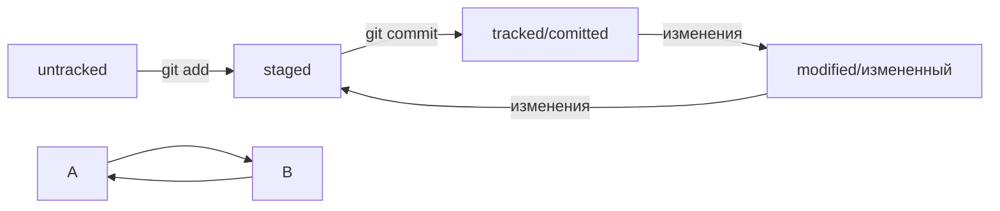

# Введение в тему Git 

 - Git - инструмент для реализации больших проектов. Git - инструмент командной работы, позволяющий работать над проектом с коллегами.*
 - Система контроля версий, или VCS, — это программное обеспечение, которое помогает отслеживать изменения в программах, текстовых файлах, больших документах, веб-сайтах и так далее.*
 - Git - самый популярный продукт VCS, который используется в командной работе. Git позволяет сохранять и "склеивать" труд разных программистов, облегчая работу над проектами.*
 - Системы контроля версий помогают разработчикам контролировать изменения в проектах и сохранять историю.*
 - Git является примером системы контроля версий и помогает хранить, изменять и анализировать историю проекта.*
---

##### Установка командной строки для пользователей Windows 

 - Перейдите на страницу официального сайта Git и установите программу. Далее запускайте программу GitBash.
---
##### Навигация в командной строке 

 - Вывести содержимое директории — ls
 - Сменить директорию — cd
 - Чтобы вернуться в родительскую директорию — то есть на уровень выше, — вместо названия папки нужно написать две точки: ..
 - Дополнительные возможности ls
 - Вызвать ls с флагом -a для отображения скрытых файлов и расширений файлов
 - Создание файлов и директорий — touch, mkdir
__Пример:__ touch my-new-file.txt # создали файл my-new-file.txt 
 - $ mkdir new-dir # создали директорию new-dir 
 - Копирование файлов — cp
__Пример:__ cp index.html src/ скопировали index.html в папку src 
 - Перемещение файлов и папок — mv
__Пример:__ mv table.csv ./very-important-files 
 - Чтение файлов — cat
__Пример:__ cat myfile.txt # распечатали содержимое файла myfile.txt
 - Удаление файлов и папок — rm, rmdir, rm -r
 - $ rm example.txt # удалили файл example.txt из текущей папки 
 - $ rmdir images # команда удалит папку images из текущей директории
  *$ rm -r images # удалили папку images со всем её содержимым из текущей директории
---
##### Инициализируем репозиторий 

Сделать папку репозиторием — git init
 - $ cd ~/dev/first-project # перешли в нужную папку
 - $ git init # создали репозиторий  
 - «Разгитить» папку, если что-то пошло не так, — rm -rf .git               
 - Проверить состояние репозитория — git status
 - После инициализации репозитория first-project запустите команду git status — она показывает текущее состояние репозитория. 
 - Подготовить файлы к сохранению — git add
 - $ git add --all # подготовили к сохранению все файлы в репозитории
 - $ git status # проверили статус 
**Добавлять файлы можно и по одному, без ключа --all**
 - $ git add todo.txt
 - $ git add readme.txt
 - $ git status 
Команда git add не сохраняет содержимое файлов в репозитории. Само сохранение, или фиксацию состояния файлов, называют коммитом (от англ. commit — «совершать», «фиксировать»). «Сделать коммит» значит сохранить текущую версию файла.*
 - Выполнить коммит — git commit
 - $ git commit -m 'Мой первый коммит!' 
 - Просмотреть историю коммитов — git log
---
# Часть 2. Информация по коммитам
##### Хеш — идентификатор коммита

Хеширование (от англ. hash, «рубить», «крошить», «мешанина») — это способ преобразовать набор данных и получить их «отпечаток» (англ. fingerprint).
Информация о коммите — это набор данных: когда был сделан коммит, содержимое файлов в репозитории на момент коммита и ссылка на предыдущий, или родительский (англ. parent), коммит. Git хеширует (преобразует) эту информацию с помощью алгоритма SHA-1 (от англ. Secure Hash Algorithm — «безопасный алгоритм хеширования») и получает для каждого коммита свой уникальный хеш — результат хеширования.
В то время, как результат работы метода hashCode() — это целое число, результат хеширования в Git — символьная строка. 
Она относительно коротка (40 символов в случае SHA-1) и состоит из цифр 0—9 и латинских букв A—F (неважно, заглавных или строчных). Хеш обладает следующими важными свойствами:
 -  если хеш получить дважды для одного и того же набора входных данных, то результат будет гарантированно одинаковый;
 -  если хоть что-то в исходных данных поменяется (хотя бы один символ), то хеш тоже изменится (причём сильно).
 *Git хранит таблицу соответствий хеш → информация о коммите. Если вы знаете хеш, вы можете узнать всё остальное: автора и дату коммита и содержимое закоммиченных файлов. Можно сказать, что хеш — основной идентификатор коммита.*
 ---
#### Исследуем лог
После вызова git log появляется список коммитов с их описанием.
Вот из каких элементов состоит описание:
Строка из цифр и латинских букв после слова commit — это уже знакомый вам хеш коммита.
- Author — имя автора и его электронная почта.
- Date — дата и время создания коммита.
- Сообщение к коммиту.
*Сокращённый лог вызывают командой git log с флагом --oneline (англ. «одной строкой»). При этом в терминале появятся только первые несколько символов хеша каждого коммита и комментарии к ним.*
---
#### HEAD — всему голова
- При вызове команды git log вы также могли заметить надпись (HEAD -> master) после хеша одного из коммитов.
- *Файл HEAD (англ. «голова», «головной») — один из служебных файлов папки .git. Он указывает на коммит, который сделан последним (то есть на самый новый).*
- Когда вы делаете коммит, Git обновляет refs/heads/master — записывает в него хеш последнего коммита. Получается, что HEAD тоже обновляется, так как ссылается на refs/heads/master.
- При работе с Git указатель HEAD используется довольно часто. Мы уже упоминали, что многие команды Git принимают в качестве параметра хеш коммита. Если нужно передать последний коммит, то вместо его хеша можно просто написать слово HEAD — Git поймёт, что вы имели в виду последний коммит.
---
#### Статусы untracked/tracked, staged и modified
##### untracked (англ. «неотслеживаемый»)
Новые файлы в Git-репозитории помечаются как untracked, то есть неотслеживаемые. Git «видит», что такой файл существует, но не следит за изменениями в нём. У untracked-файла нет предыдущих версий, зафиксированных в коммитах или через команду git add.
##### staged (англ. «подготовленный»)
После выполнения команды git add файл попадает в staging area (от англ. stage — «сцена», «этап [процесса]» и area — «область»), то есть в список файлов, которые войдут в коммит. В этот момент файл находится в состоянии staged.
##### tracked (англ. «отслеживаемый»)
Состояние tracked — это противоположность untracked. Оно довольно широкое по смыслу: в него попадают файлы, которые уже были зафиксированы с помощью git commit, а также файлы, которые были добавлены в staging area командой git add. То есть все файлы, в которых Git так или иначе отслеживает изменения.
##### modified (англ. «изменённый»)
Состояние modified значит, что Git сравнил содержимое файла с последней сохранённой версией и нашёл отличия. Например, файл был закоммичен и после этого изменён.
##### Для файлов в состояниях staged и modified обычно не указывается, что они также tracked, потому что это состояние подразумевается.
Команда git add добавляет в staging area только текущее содержимое файла. Если вы, например, сделаете git add file.txt, а затем измените file.txt, то новое содержимое файла не будет находиться в staging. Git сообщит об этом с помощью статуса modified: файл изменён относительно той версии, которая уже в staging. 
##### Чтобы добавить в staging последнюю версию, нужно выполнить git add file.txt ещё раз.
### Оформление сообщений к коммитам
Сообщения к коммитам важны для определения содержимого коммита и облегчения работы с ним.
- Сообщения должны быть короткими, информативными и легко читаемыми.
- Разные команды и проекты могут использовать разные стили оформления сообщений.
- Общие рекомендации включают длину сообщения от 30 до 72 символов, использование глаголов в инфинитиве и указание Jira-ID при корпоративном стиле.
- Conventional Commits предлагает стандартизированный формат коммита с указанием типа изменений.
- GitHub-стиль позволяет указывать ссылки на задачи в сообщениях коммитов.
- Рекомендации для использования инфинитивов и повелительного наклонения в сообщениях на разных языках также существуют.
---
## Дополнительное задание
HEAD -- это голова.
Коммит -- это всему голова.
Статусы файлов:
<тут пустая строка!>

